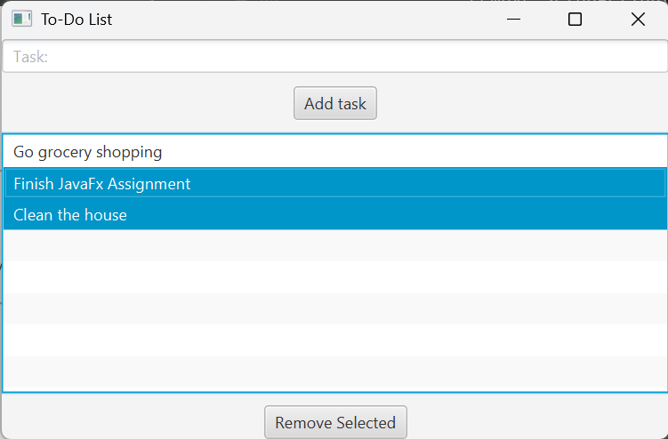

# Simple-JavaFX-To-Do-List-Manager

This is a basic JavaFX project for managing tasks.  
Users can add tasks to a list and remove them once completed.  

## Features
- Add new tasks via a text field and button.
- Display tasks in a `ListView`.
- Remove one or more selected tasks.
- Tasks are stored in an `ArrayList`.

## Preview

## How to Run
1. Clone this repository.
2. Open the project in your IDE (e.g., IntelliJ or Eclipse) with JavaFX set up.
3. Run the `Main.java` file.

## Assignment Context
This project was originally built as part of a JavaFX assignment.  
Requirements included adding tasks, displaying them, and removing selected ones.

---
